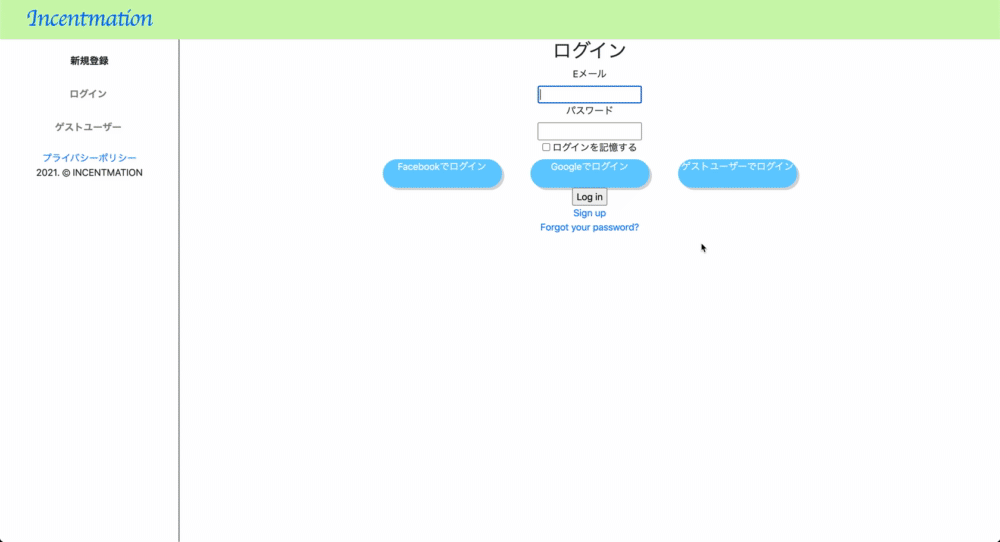
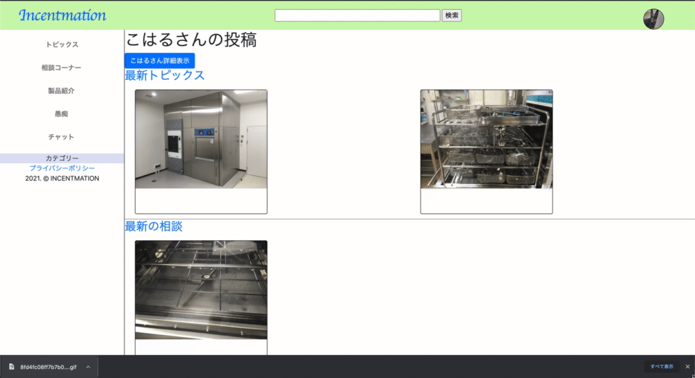
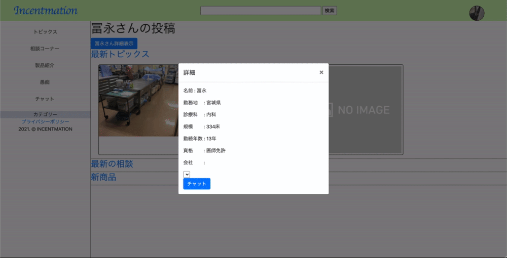
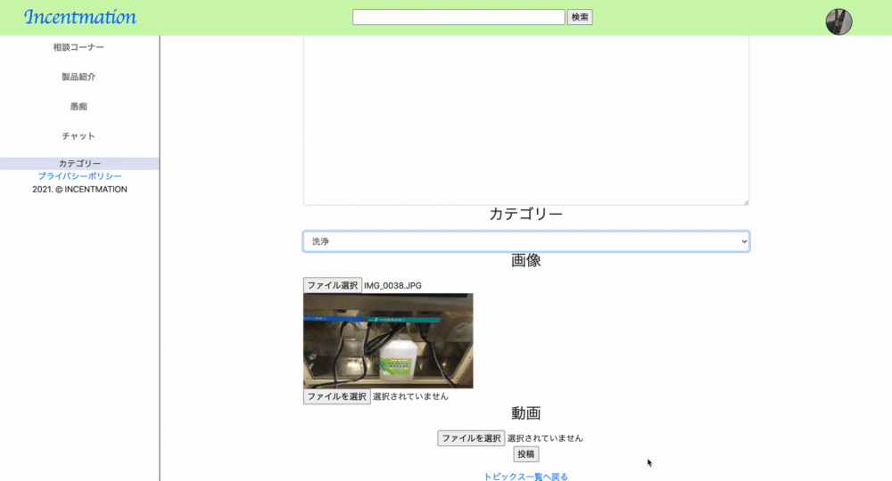
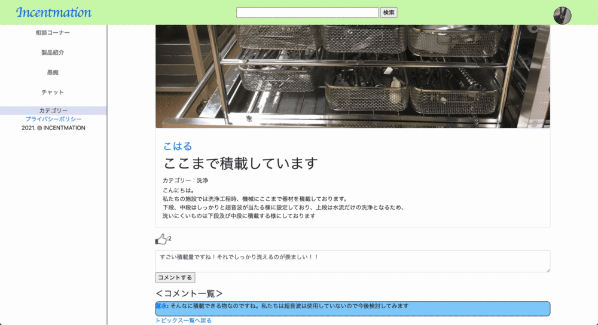
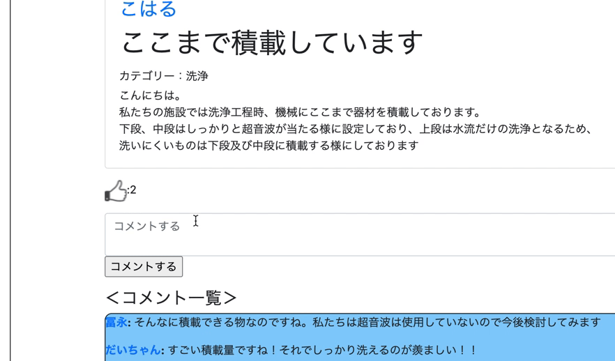
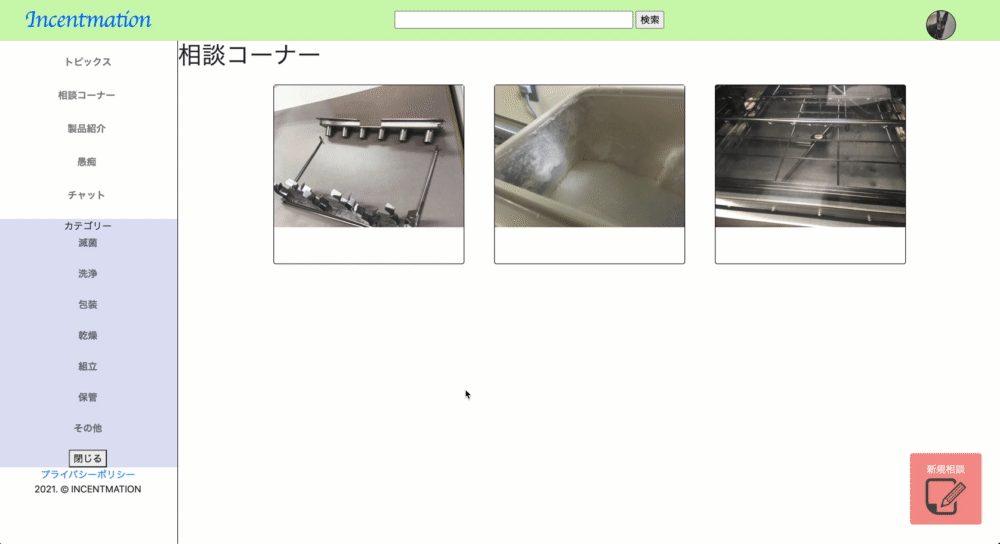
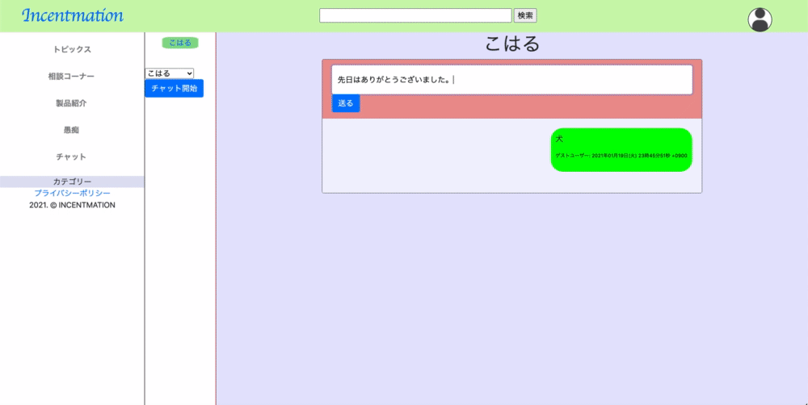
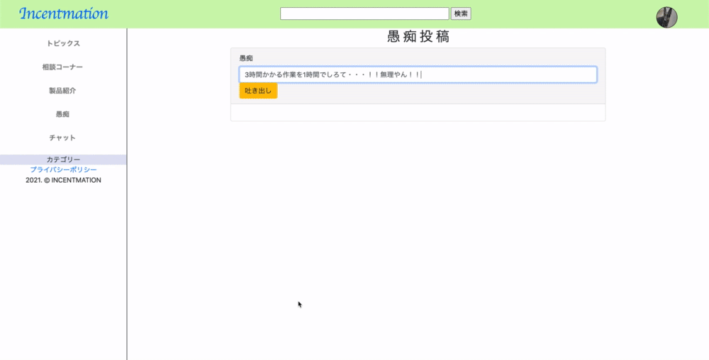

## アプリケーション名  
# incentmation(インセントメーション)  

## アプリケーションの概要
incentmationはinformation(情報)とconcentration(集中する)を合わせた造語の意味通り、情報を集中させるサイトを目指しています。<br/>特に、ニッチな業界では情報の統制が行われていない事が多く、知りたい事を探すだけでしんどい思いをする事が多くあります。<br/>
そこで、個々の問題をみんなで解決できる場所を提供し早期の問題解決のいとぐちになればと考えています。<br/>
アプリ内では、主にトピックス、相談、商品紹介を基本としており、各個人が様々な情報の発信が行える他、現場で困っている事を投稿し、同じ事を解決したことのある人などから様々な解決方法を獲得し自身の現場にフィードバックしていけるようにします。そして、商品紹介ですが、様々な状況に直面した事があるであろう、その業界に特化した商品を販売している企業がこのサイトに参加することにより、よりたくさんの情報が落とし込まれる事を期待しています。商品紹介はその問題解決の一役を担うものをスムーズに紹介できる場となると考えています。<br/>
また、個人間で行える会話スペースを取り入れる事でより密な情報収集ができると考えています
<br/>
<br/>
***

## アプリケーションURL:<br/>
 http://www.incentmation.tk
<br/>
***

## Basic認証<br/>
ID : koharu <br/>
password :0930<br/>
***

## テスト用アカウント<br/>
Email: ggg@ooo.com<br/>
password: iii999<br/>
<br/>
あるいは<br/>
ゲストログインをご使用ください
***

## 利用方法<br/>
* WebブラウザGoogle Chromeの最新版を利用してアクセスしてください。<br/>
  * ただしデプロイ等で接続できないタイミングもございます。その際は少し時間をおいてから接続してください。<br/>
* 接続先およびログイン情報については、上記の通りです。<br/>
* 同時に複数の方がログインしている場合に、ログインできない可能性があります。<br/>
* テストアカウントでログイン→トップページからトピックス→情報投稿→投稿ページ記入（画像・動画は無くても可）→情報投稿<br/>
  * 相談、商品紹介も同様<br/>
* テストアカウントでログイン→トップページからチャット→相手選択→チャットルームでチャット開始。あるいは、トピックス投稿等にある個人名を選択→個人詳細表示→チャット選択→チャット開始<br/>
* テストアカウントでログイン→トップページから愚痴→愚痴投稿 <br/>
***

## 目指した課題解決
* 閉鎖された業界での情報共有<br/>
  * 業界で起こっている様々な変化へ素早くキャッチアップできるように、一つのサイトで情報が網羅できる<br/>
* 早期の問題解決
  * 1人で悩まずに横の繋がりで問題を解決していく。そこで起こった問題は別の場所でも起こっている可能性を考え、幅広い方へ相談し問題解決を行う<br/>
* 便利な商品の紹介<br/>
  * 問題解決に向けて、便利になりうる商品を紹介し道具で早期の問題解決へつなげる<br/>
  * 多くの情報を持っているであろう企業がサイトに参加することにより情報の活発化を狙う<br/>
* ストレス発散<br/>
  * 日々過酷な業務に追われる中で蓄積するであろうストレスを言葉にできるスペースを提供。投稿したコメントは1時間で削除されるため、安心して投稿できる<br/>
***

## 洗い出した要件<br/>
* 情報が整理されている（カテゴライズ）<br/>
* 個人の見解が見れる（コメント機能）<br/>
* 意見の交換（チャット（グループ・個人））<br/>
* 相談フォーム（コメント機能・画像・動画）<br/>
* 情報が見やすい（画像・動画・検索）<br/>
* 企業も情報を持っているので、宣伝含めコミュニティーへの参加（宣伝フォーム）<br/>
* 情報の流出を抑えるためメンバー制（ログイン）<br/>
* 愚痴を言える場所（１時間前後で自動削除機能）<br/>
***

## 実装した機能<br/>
* ユーザー管理機能
  * 新規登録機能<br/>
    * 新規登録をemail・SNSアカウントで行える<br>
    <br/>
  * ログイン機能<br/>
    * email・SNSアカウントで行える<br/>
    <br/>
  * 個人詳細機能表示<br/>
    * 個人の詳細情報を閲覧できる。また、どのような投稿をしたかも確認できる<br>
    <br/>
  * チャットへの遷移
    * 詳細相手とのチャットルームへ遷移できる<br/>
    <br/>
  * 各ページへ遷移できる
  
* トピックスの投稿機能<br/>
  * 一覧表示機能<br/>
  * 各トピックスへ遷移できる
  <br/>
  * 新規投稿機能<br/>
    * 画像・動画も投稿できる
    <br/>
  * 情報詳細機能
    * 動画の視聴が可能<br/>
    <br/>

  * 情報編集機能
    * 投稿情報の編集ができる<br/>
  * コメント機能<br/>
     <br/>
  * 反応機能<br/>
    * 投稿に関してのユーザーの関心度が分かる
    <br/>
    <br/>
      * <font color="Red">相談機能・宣伝機能は同上</font><br/>
  * 相談機能にて
    * 問題か解決してるかどうか一目で分かる<br/>
    <br/>
<br/>
* チャット機能<br/> 
  * 個人間でチャットが出来る<br/>
  <br/>
<br/>
* 独り言投稿機能<br/>
  * 独り言が投稿でき、1時間で投稿画面から削除される<br/>
  <br/>
<br/>
***

## 工夫したポイント
  * 各情報には画像と動画を投稿出来るようにしています。情報に画像や動画を添付することにより、より正確に情報を取得する事ができます。<br/>
  * 愚痴の投稿については、制限時間を1時間に設定し投稿が削除されるようになってます。そうすることにより投稿した内容が後々まで残ることなく安心して投稿出来ます。<br/>
  * SNS認証を可能にしたことにより、ロウグイン時の入力負担を軽減させました。<br/>
  * 反応機能をつけることにより、投稿に関しての関心度を図る事ができます。<br/>
  * 各個人の詳細ページから個人間のチャットページへ遷移することができます。<br/>
  
***

## 使用技術（開発環境）<br/>
### バックエンド<br/>
Ruby, Ruby on Rails<br/>
<br/>

### フロントエンド<br/>
JavaScript, JQuery, Bootstrap, React<br/>
<br/>

## データベース<br/>
MySQL, SequelPro<br/>
<br/>

## インフラ<br/>
AWS(EC2, route53), Capistrano<br/>
<br/>

## Webサーバー（本番環境）<br/>
nginx<br/>
<br/>

## アプリケーションサーバー（本番環境）<br/>
unicorn<br/>
<br/>

## ソース管理<br/>
GitHub, GitHubDesktop<br/>
<br/>

## テスト<br/>
RSpec<br/>
<br/>

## エディタ<br/>
VSCode<br/>
<br/>

***
## 実装予定の機能<br/>
* グループチャット機能<br/>
***

## ER図<br/>
[](https://gyazo.com/f12adacd0ecc2b9ee64595e8c236d7b4)<br/>
***

## ローカルでの動作方法<br/>
```
% git clone https://github.com/tatsunori-koharu/incentmation.git
% cd incentmation
% bundle install
% yarn install 
% rails db:create
% rails db:migrate
% rails s
```
<br/>

***

## 制作環境<br/>
ruby: 2.6.5<br/>
rails:6.0.3.4<br/>

***

## テーブル設計

## users テーブル

| Column               | Type    | Options                   |
| -------------------- | ------- | ------------------------- |
| nickname             | string  | null: false, unique: true |
| email                | string  | null: false, unique: true |
| encrypted_password   | string  | null: false               |
| location_id          | integer | null: false               |
| department_id        | string  | null: false               |
| bed                  | integer |                           |
| service_years        | integer | null; false               |
| license              | string  |                           |
| company              | string  |                           |

### Association

- has_many :articles
- has_many :article_comments
- has_many :article_likes
- has_many :consultations
- has_many :consultation_comments
- has_many :consultation_fixes
- has_many :promotions
- has_many :promotion_comments
- has_many :promotion_likes
- has_many :chats, through: :user_chats
- has_many :user_chats
- has_many :chat_messages
- has_many :donkeykings

## articles テーブル

| Column               | Type       | Options                        |
| -------------------- | ---------- | ------------------------------ |
| title                | string     | null: false                    |
| content              | text       | null: false                    |
| category_id          | integer    | null: false                    |
| user                 | references | null: false, foreign_key: true |

### Association

- belongs_to :user
- has_many   :article_comments
- has_many   :article_likes

## article_commentテーブル

| Column               | Type       | Options                        |
| -------------------- | ---------- | ------------------------------ |
| comment              | text       | null: false                    |
| article              | references | null: false, foreign_key: true |
| user                 | references | null: false, foreign_key: true |

### Association

- belongs :article
- belongs :user

## article_likesテーブル

| Column               | Type       | Options                        |
| -------------------- | ---------- | ------------------------------ |
| article              | references | null: false, foreign_key: true |
| user                 | references | null: false, foreign_key: true |

### Association

- belongs :article
- belongs :user

## consultationテーブル

| Column               | Type       | Options                        |
| -------------------- | ---------- | ------------------------------ |
| title                | string     | null: false                    |
| content              | text       | null: false                    |
| category_id          | integer    | null: false                    |
| user                 | references | null: false, foreign_key: true |

### Association

- belongs_to :user
- has_many   :consultation_comments
- has/many   :consultation_fixes

## consultation_commentsテーブル

| Column               | Type       | Options                        |
| -------------------- | ---------- | ------------------------------ |
| comment              | text       | null: false                    |
| consultation         | references | null: false, foreign_key: true |
| user                 | references | null: false, foreign_key: true |

### Association

- belongs_to :user
- belongs_to :consultation

## consultation_fixesテーブル

| Column               | Type       | Options                        |
| -------------------- | ---------- | ------------------------------ |
| consultation         | references | null: false, foreign_key: true |
| user                 | references | null: false, foreign_key: true |

### Association

- belongs :consultation
- belongs :user

## promotionテーブル

| Column               | Type       | Options                        |
| -------------------- | ---------- | ------------------------------ |
| name                 | string     | null: false                    |
| content              | text       | null: false                    |
| category_id          | integer    | null: false                    |
| user                 | references | null: false, foreign_key: true |

### Association

- belongs_to :user
- has_many   :promotion_comments
- has_many   :promotion_likes

## promotion_commentsテーブル

| Column               | Type       | Options                        |
| -------------------- | ---------- | ------------------------------ |
| comment              | text       | null: false                    |
| promotion            | references | null: false, foreign_key: true |
| user                 | references | null: false, foreign_key: true |

### Association

- belongs_to :user
- belongs_to :promotion

## promotion_likesテーブル

| Column               | Type       | Options                        |
| -------------------- | ---------- | ------------------------------ |
| promotion            | references | null: false, foreign_key: true |
| user                 | references | null: false, foreign_key: true |

### Association

- belongs :promotion
- belongs :user

## chatテーブル

| Column               | Type       | Options                        |
| -------------------- | ---------- | ------------------------------ |

### Association

- has_many :user_chats
- has_many :users, through: :user_chats
- has_may  :chat_messages

## user_chatsテーブル

| Column               | Type       | Options                        |
| -------------------- | ---------- | ------------------------------ |
| chat                 | references | null: false, foreign_key: true |
| user                 | references | null: false, foreign_key: true |

### Association

- belongs :chat
- belongs :user

## chat_messagesテーブル

| Column               | Type       | Options                        |
| -------------------- | ---------- | ------------------------------ |
| message              | string     | null: false                    |
| chat                 | references | null: false, foreign_key: true |
| user                 | references | null: false, foreign_key: true |

### Association

- belongs_to :user
- belongs_to :chat

## donkeykingsテーブル

| Column               | Type       | Options                        |
| -------------------- | ---------- | ------------------------------ |
| content              | string     | null: false                    |
| user                 | references | null: false, foreign_key: true |

### Association

- belongs_to :user